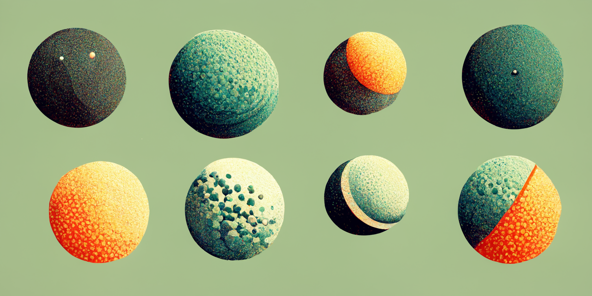

# ❇️ XYZT

<!--Badges-->
<!--⚠️WARNING: This section was generated by https://github.com/hejny/batch-project-editor/blob/main/src/workflows/800-badges/badges.ts so every manual change will be overwritten.-->


[](https://github.com/hejny/xyzt/blob/master/LICENSE)
[](https://www.npmjs.com/package/xyzt)
[](https://packagequality.com/#?package=xyzt)
[](https://snyk.io/test/github/hejny/xyzt)
[](https://github.com/hejny/xyzt/issues)

<!--/Badges-->

The vector simple vector manipulation class.


<!--Wallpaper-->
<!--⚠️WARNING: This section was generated by https://github.com/hejny/batch-project-editor/blob/main/src//workflows/315-ai-generated-wallpaper/4-aiGeneratedWallpaperUseInReadme.ts so every manual change will be overwritten.-->

<!--/Wallpaper-->

## Install

```bash
npm i xyzt
```

TODO: Write some usage and description

<!--Contributing-->
<!--⚠️WARNING: This section was generated by https://github.com/hejny/batch-project-editor/blob/main/src/workflows/810-contributing/contributing.ts so every manual change will be overwritten.-->

## 🖋️ Contributing

I am open to pull requests, feedback, and suggestions. Or if you like this utility, you can [☕ buy me a coffee](https://www.buymeacoffee.com/hejny) or [donate via cryptocurrencies](https://github.com/hejny/hejny/blob/main/documents/crypto.md).

You can also ⭐ star the xyzt package, [follow me on GitHub](https://github.com/hejny) or [various other social networks](https://www.pavolhejny.com/contact/).

<!--/Contributing-->

<!--Partners-->
<!--⚠️WARNING: This section was generated by https://github.com/hejny/batch-project-editor/blob/main/src/workflows/820-partners/partners.ts so every manual change will be overwritten.-->

## ✨ Partners


<a href="https://collboard.com/">
  
</a>
&nbsp;&nbsp;&nbsp;
<a href="https://czech.events/">
  
</a>
&nbsp;&nbsp;&nbsp;
<a href="https://sigmastamp.ml/">
  
</a>


[Become a partner](https://www.pavolhejny.com/contact/)

<!--/Partners-->
